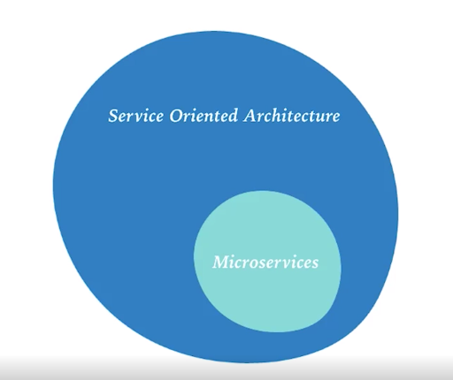
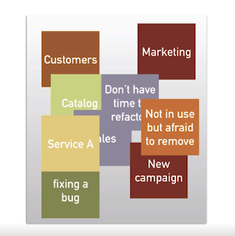
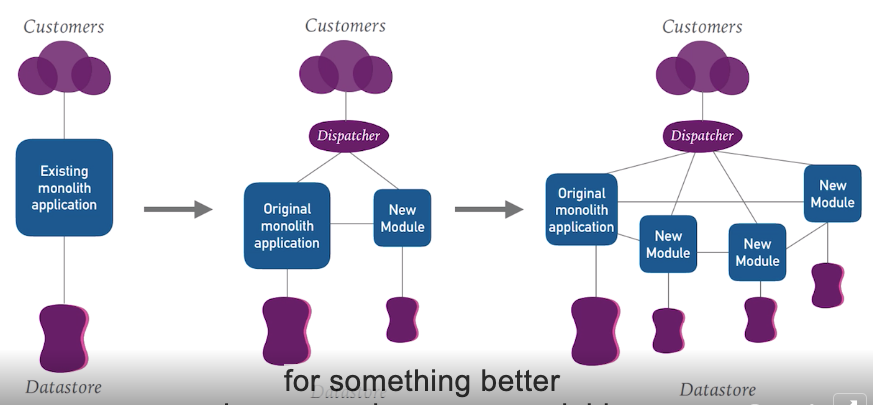

1.1 Definining microservices
============================

**Microservices**
-----------------

* Independent deployable sevices
* Single Responsibility Principle
* Communication done through agnostic APIs
* Highly decoupled

**A bit of History**
--------------------

**STRANGLER PATTERN**
---------------------

**WHY NOW?**
------------

* Infrastructure automation
* Virtualization on demand
* Continuous delivery
* Domain Driven Design

1.2 Pros and cons of implementing a microservices architecture
==============================================================

PROS AND CONS
-------------

### PROS

* Technology flexibility
* Scalability
* Lower risk of deployment
* Small, independent teams
* Reusability
* Replaceability

### CONS

* Complex infrastructure
* Complex delpoyment process
* Performance
* Resilience and monitoring

1.3 Is a microservice architecture right for your organization?
===============================================================

DRIVERS
-------

* Frequent and fast deployments
* Innovation
* Attract new talent
* Current architecture can’t support future business requirments

Do we have the right business requirements?

Are your development teams mature?

* XP practices (○)
* Continuous integration（○）
* Infrastructre as code （✖️）

How mature is your organization?

* Vertical teams (○)
* DevOps culture （○）
* Continuous delivery （✖️）

