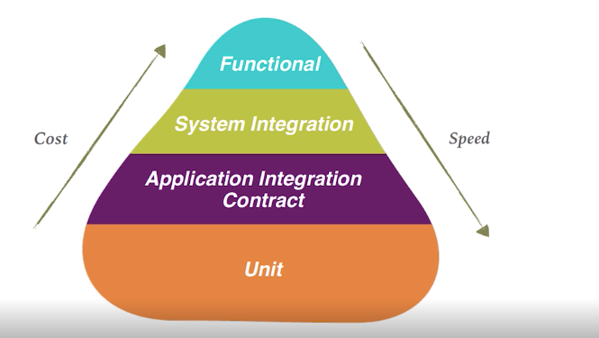
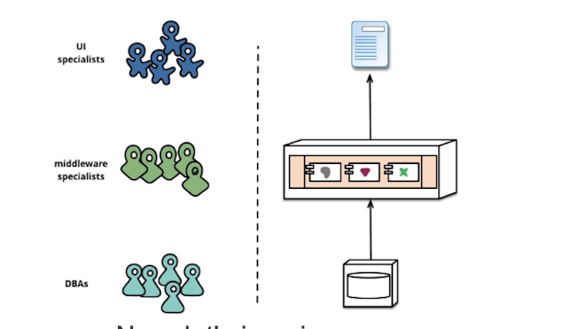

2.1 Testing 
============

PREREQUISITES
-------------

* Testing
* Automation
* Continuous delivery
* Evolutionary architecture
* Organizational change

CONSUMER DRIVEN CONTRACTS
-------------------------

2.2 Automation and Continuous Delivery 
=======================================

INFRASTRUCTURE AS CODE
----------------------

2.3 Evolutionary architecture 
==============================

2.4 Organizational change
=========================

LAYERED/TIERED ARCHITECTURE
---------------------------

**ROLE OF THE ARCHITECT**
-------------------------

As an architect 

I want to set up some guidelines 

So that teams can work effectively

ROLE OF THE DEVELOPER
---------------------

As a developer 

I want to know the best practices 

So that I can apply them

