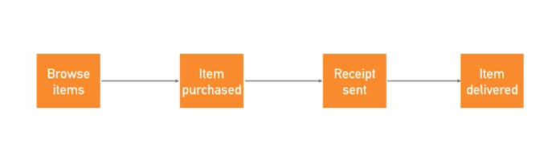
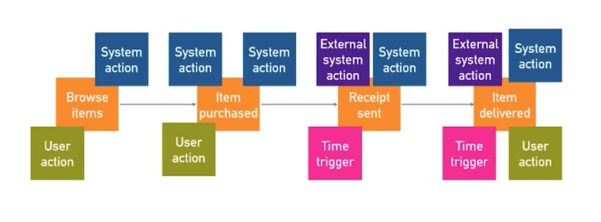
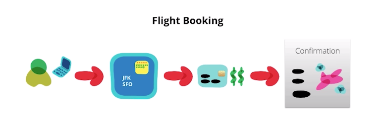
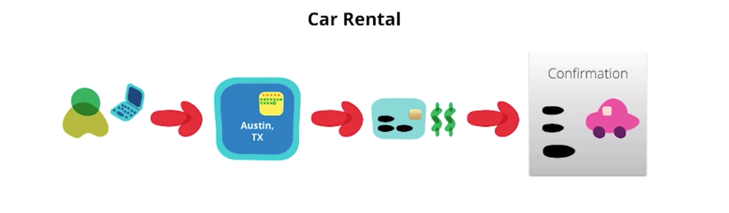
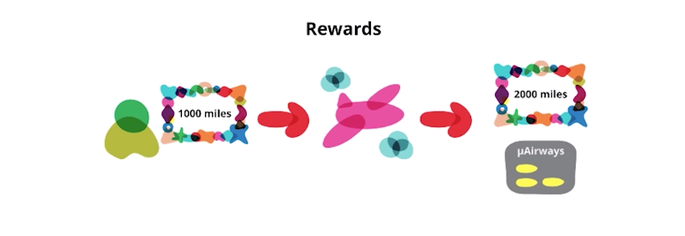
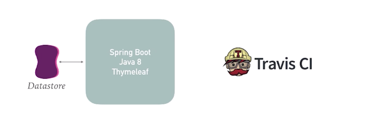
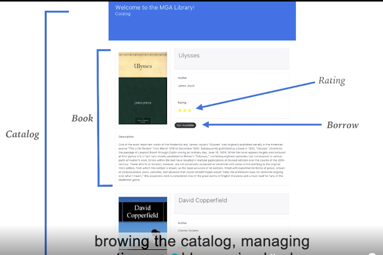
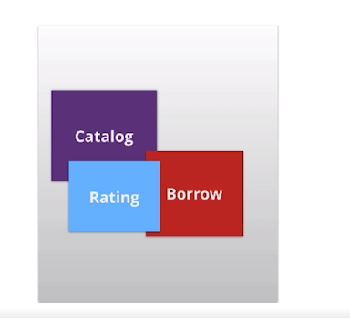
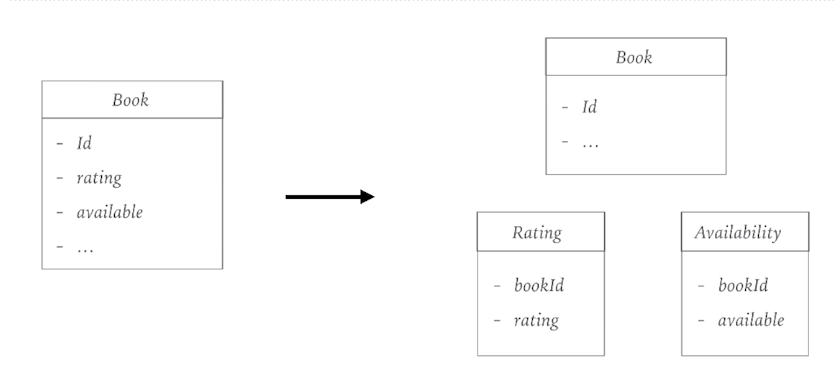

3.1 Identify contexts
=====================

DOMAIN-DRIVEN DESIGN
--------------------

* Connect implementation to an evolving model
* Collaboration between business and tech (ubiquitous language)

EVENT STORMING
--------------

* Domain modeling exercise
* Aimed to achieve a common understanding of the domain in which the software must operate
* Done with groups of business and technology people
* Read more: https://techbeacon.com/introduction-event-storming-easy-way-achieve-domain-driven-design

MICROAIRWAYS
------------

MicroAirways has cheap airline tickets, can rentals and the Traveller reward program

NEW REQUIREMENT
---------------

* We want to change the way rating system work
* We want to add new functionality to the rating system
* We have a series of hypotheses we want to try and change rapidly

3.2 Decouple contexts
=====================

BEFORE YOU START...
-------------------

* Continuous Integration pipeline in place
* Confidence in your tests
* Metrics

REFACTORING TECHNIQUES - COMPOSING METHODS

REFACTORING TECHNIQUES - MOVING FEATURES BETWEEN OBJECTS

REFACTORING TECHNIQUES - ORGANIZING DATA

